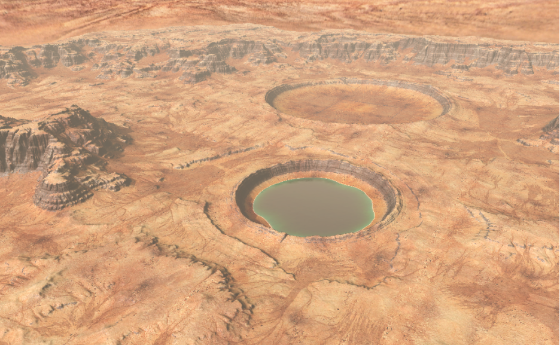
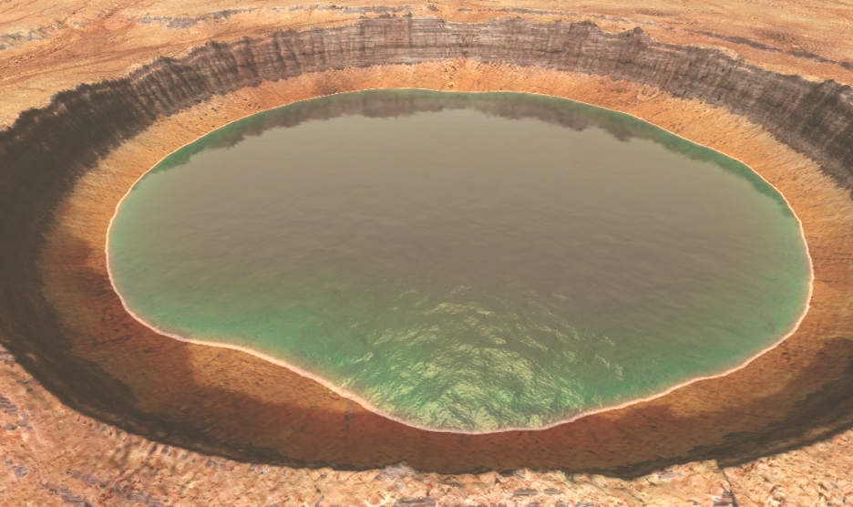
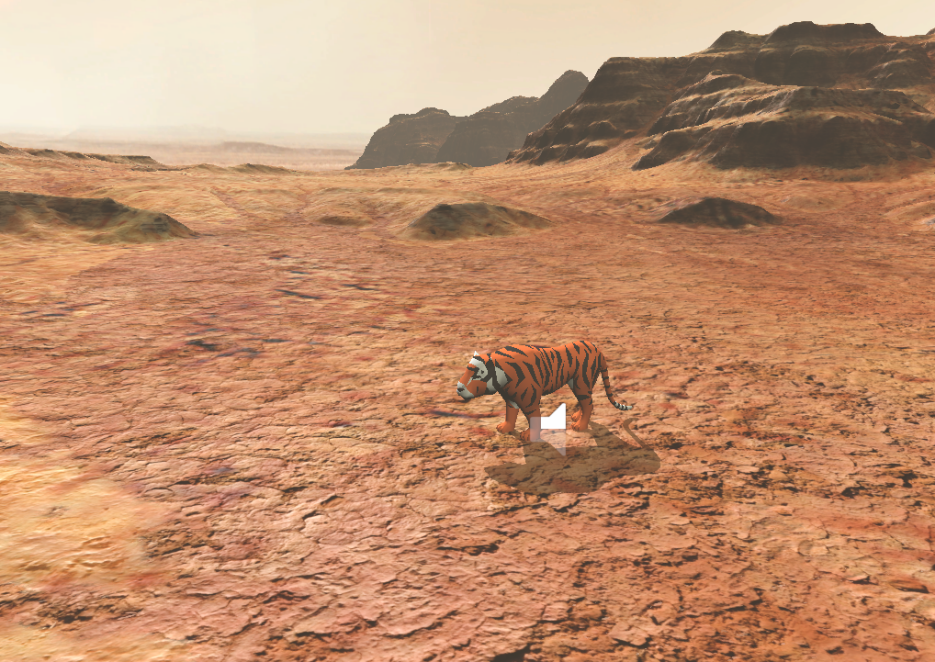
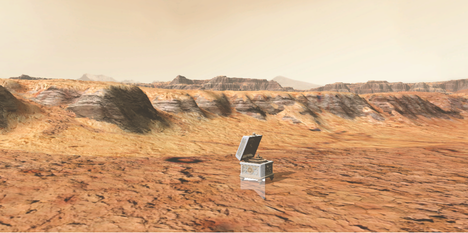
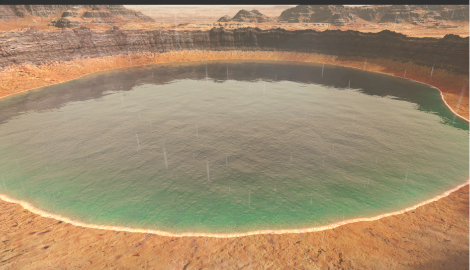
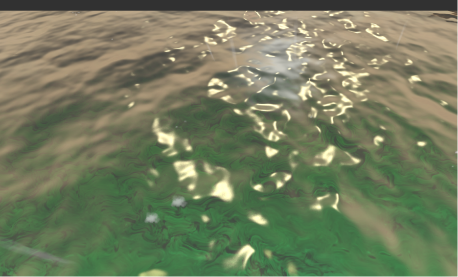

# SoundGame交互音频原型说明文档

Unity 2022.3.62f3c1

本项目围绕“音频与玩法/交互状态之间的关系”制作，展示脚步声、天气环境声、空间混响音频系统。默认提交场景为可直接编辑的实体场景，场景对象、碰撞体、音频源、粒子和玩家对象均已保存为真实 GameObject。

## 一、项目基本信息

|项目项|内容|
|---|---|
|项目名称|SoundGame|
|Unity 版本|2022.3.62f3c1|
|项目类型|3D 交互音频原型|
|默认实体场景|Assets/Scenes/Mars_scene.unity|
|生成源场景|Assets/Scenes/Mars_scene.unity|
|主要资源来源|UnityStore-Deep Desert - Micro Biome v1.0.1|

## 二、操作说明

|操作|功能|
|---|---|
|WASD|移动|
|Shift|奔跑|
|Space|跳跃|
|鼠标|转动视角|
|Esc|释放鼠标|

## 三、场景内容

- Unity商店火星沙漠环境，场景略大，充分玩家探索。
- 真人可走测试不同声音音效按普通地形和水中地形顺序布置。
- 测试路线旁放置引擎AudioSource音频演示，便于交互调试。
- 献给爱丽丝用3D环绕做音效和具体内容。
- 天气系统包含晴天、雨天和雨粒子联动。

## 四、核心音频设计

### 1. 路面脚步声

FPSController上挂载FootStep Sounds组件用于播放脚步声；湖面区域挂载脚本`FootSetpChange`，玩家物体标记Tag=Player。玩家进入触发区域切换水中脚步声，离开触发区域切换陆地脚步声。

### 2. 天气与昼夜环境声

通过`RainScript`控制晴雨音效，雨天脚本自动播放雨声；逻辑设定每10秒切换一次降雨强度，强度为0时切换为晴天，播放鸡鸣音效。

### 3. 老虎靠近触发音效

采用物理碰撞检测`OnTriggerEnter`判断玩家进入触发范围，玩家靠近标记Tag为Tiger的老虎物体时，自动播放老虎咆哮音效。

### 4. 3D环绕音效

音乐盒播放《献给爱丽丝》3D音效，实现距离衰减效果：玩家距离越远音量越小，距离越近音量越大。
通过AudioSource的3DSoundSettings配置实现，将SpatialBlend设置为0.68，3D空间听觉效果更佳。

## 五、音频素材

音频资源存放路径：`Assets/Sounds`，包含下雨、鸡鸣、走路、水中走路、音乐盒等音效。

|材质/类型|音频文件|说明|
|---|---|---|
|普通走路|Footstep01，Footstep02|普通路面行走音效|
|水中走路|WaterWalk1，WaterWalk2|水坑内行走水声|
|老虎咆哮|lh|玩家靠近老虎触发的咆哮声|
|下雨|rain_medium|雨天滴答雨声|
|鸡鸣|jiming|切换晴天时播放|
|音乐盒|Yyh|《献给爱丽丝》3D环绕背景音乐|

## 六、工程结构

|资源路径|用途|
|---|---|
|Assets/Sounds|全部音频音效素材存放目录|
|Assets/Scenes|场景文件、场景光照配置文件|
|Assets/AQUAS-Lite|水体资源、水体Shader渲染文件|
|Assets/ithappy|老虎模型素材、老虎碰撞MeshCollider|
|Assets/MarsEnv|火星沙漠场景资源、天空盒SkyBox物件|
|Assets/RainMaker|降雨逻辑对象、雨效果Shader、雨控制脚本|
|Assets/Standard Assets|第一人称角色控制器资源|
|Assets/Scripts|项目全部业务控制逻辑代码|

## 七、自检与实现记录

1. 已导入Unity商店资源：Deep Desert - Micro Biome v1.0.1
2. 完成项目资源、场景实体、碰撞组件、音频资源、各类核心组件引用有效性校验
3. 完整校验3D场景，核查地形坑洞全部碰撞体、地形组件配置
4. 完成第一人称移动逻辑、音频监听接收器检测功能开发
5. 自定义天空盒Skybox、粒子专属Shader

## 八、关键截图

图1：总场景展示

图2：水源以及坑洞的特写

图3：老虎位置与靠近触发音效展示

图4：音乐盒位置与3D环绕音效点位

图5：雨天材质校验，雨粒子方向、颜色效果正常

图6：水体Shader光照效果自测

## 九、编辑器工具

|工具|用途|
|---|---|
|Unity2022.3.62f3c1|项目工程创建、场景编辑、整体调试|
|Vs Studio2022|C#脚本代码编写、调试|
|Adobe Audition|音频剪辑、去除音效空白、音效处理|